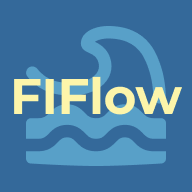

# FIFlow - 외국인 투자 동향 분석 플랫폼

<div align="center">
  
</div>

## 📋 프로젝트 개요

FIFlow는 외국인 투자 동향 및 주식 정보를 실시간으로 제공하는 서버리스 기반 애플리케이션입니다. 사용자는 Flutter로 제작된 모바일 앱을 통해 관심 종목을 등록하고, 관련된 최신 데이터를 확인할 수 있습니다. 데이터는 AWS Lambda에서 동작하는 Python 크롤러가 수집하며, API 서버를 통해 앱에 제공됩니다.

## 🏗️ 아키텍처

```
+----------------+      +---------------------+      +--------------------+
|                |      |                     |      |                    |
|  Flutter App   |----->|   API Gateway       |----->|   API Server       |
| (fiflow_app)   |      | (HTTP API)          |      | (Node.js Lambda)   |
|                |      |                     |      |                    |
+----------------+      +----------+----------+      +----------+---------+
                                   |                           |
                                   |                           |
                      +------------v------------+      +-------v-------+
                      |                         |      |               |
                      |   Crawler Trigger       |----->|   Crawler     |
                      |  (API or EventBridge)   |      | (Python Lambda) |
                      |                         |      |               |
                      +-------------------------+      +-------+-------+
                                                               |
                                                               |
                                                     +---------v---------+
                                                     |                   |
                                                     |     DynamoDB      |
                                                     |                   |
                                                     +-------------------+
```

## 🛠️ 기술 스택

| 구분 | 기술 |
| --- | --- |
| **Frontend** | Flutter, Dart, Hive, Kakao SDK, flutter_dotenv |
| **Backend** | Node.js, Express.js, Serverless Framework, AWS Lambda, API Gateway |
| **Database** | AWS DynamoDB |
| **Data Crawling** | Python, BeautifulSoup, Requests, AWS Lambda |
| **DevOps** | AWS IAM, Serverless Framework |

## 📂 프로젝트 구성

- **`fiflow_app/`**: 사용자를 위한 Flutter 모바일 애플리케이션입니다.
- **`api-server/`**: Flutter 앱과 통신하는 백엔드 API 서버입니다. (Node.js, AWS Lambda)
- **`crawler/`**: 주식 및 지수 데이터를 수집하는 Python 크롤러입니다. (Python, AWS Lambda)

---

## 🚀 시작하기

### 사전 요구사항

- Flutter
- Node.js & npm
- Python
- [Serverless Framework](https://www.serverless.com/framework/docs/getting-started)
- [AWS CLI](https://aws.amazon.com/cli/) (프로파일 설정 완료)

### 1. 저장소 클론

```bash
git clone https://github.com/eunhak11/FIFlow.git
cd FIFlow
```

### 2. 환경 변수 설정

각 서비스 디렉토리의 `.env` 파일을 생성하고 필요한 환경 변수를 설정합니다.

- **`api-server/.env`**:
  ```
  JWT_SECRET=your_jwt_secret
  KAKAO_CLIENT_ID=your_kakao_client_id
  KAKAO_CLIENT_SECRET=your_kakao_client_secret
  KAKAO_REDIRECT_URI=your_kakao_redirect_uri
  CORS_ORIGIN=http://localhost:3000
  ```
- **`fiflow_app/assets/.env`**:
  ```
  API_BASE_URL=https://<your-api-gateway-id>.execute-api.ap-northeast-2.amazonaws.com/dev
  ```

### 3. 백엔드 및 크롤러 배포

각 서버리스 애플리케이션을 AWS에 배포합니다.

```bash
# API 서버 배포
cd api-server
npm install
serverless deploy

# 크롤러 배포
cd ../crawler
# 가상환경 설정 및 requirements 설치 권장
serverless deploy
```

### 4. Flutter 앱 실행

배포된 API 서버의 엔드포인트를 `fiflow_app/assets/.env` 파일에 설정한 후 앱을 실행합니다.

```bash
cd ../fiflow_app
flutter pub get
flutter run
```

##  주요 기능

- **실시간 데이터 제공**: 크롤러를 통해 수집된 외국인 순매매, 주가, 시장 지수 데이터를 제공합니다.
- **서버리스 기반**: 모든 백엔드 로직은 AWS Lambda 위에서 동작하여 확장성이 뛰어나고 유지보수 비용이 저렴합니다.
- **소셜 로그인**: 카카오 로그인을 통해 사용자를 인증하고 JWT 토큰을 발급합니다.
- **관심 종목 관리**: 사용자는 원하는 주식 종목을 추가하고 삭제할 수 있습니다.