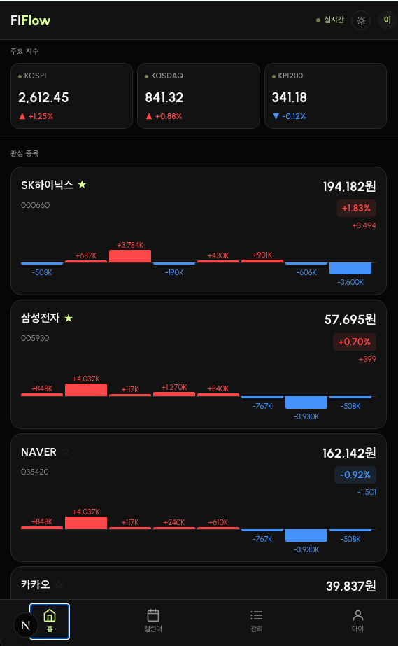
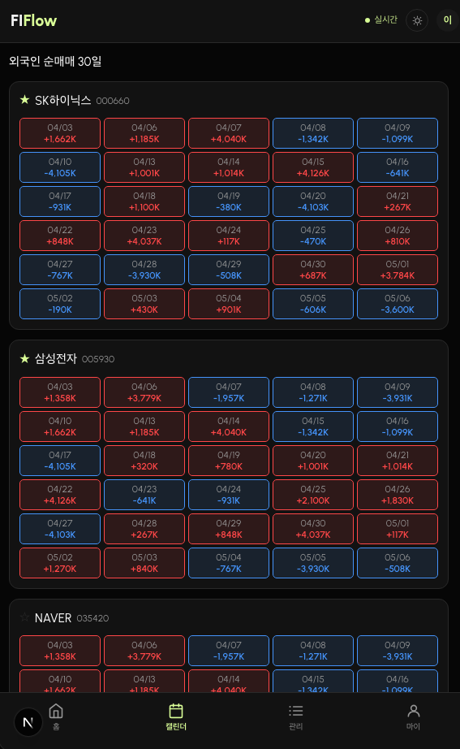
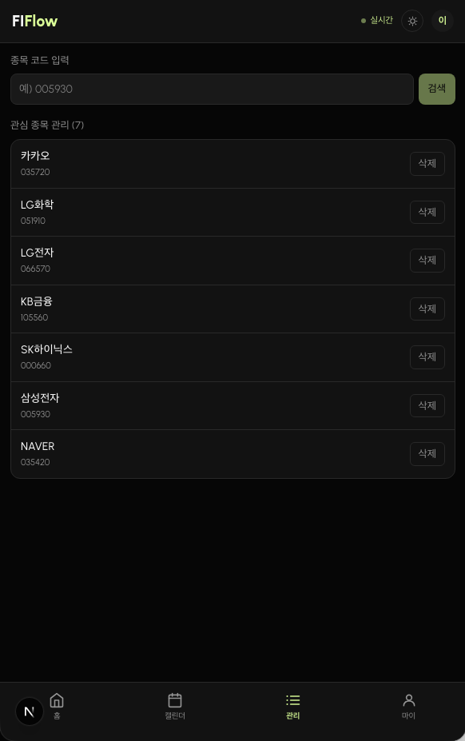
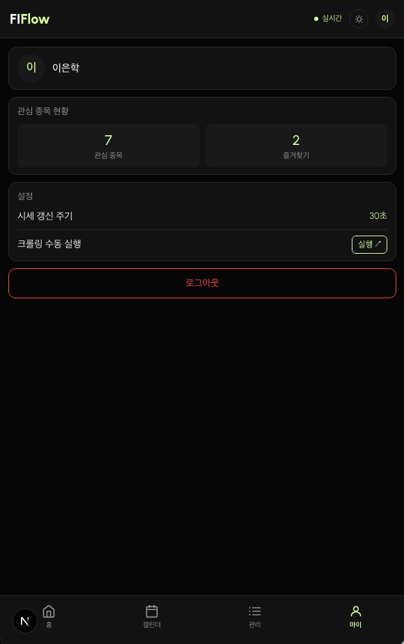

# FIFlow v2

외국인 투자 동향 및 주식 정보를 제공하는 개인용 금융 웹앱 (PWA)

| 메인 대시보드 | 외국인 순매매 캘린더 |
|:---:|:---:|
|  |  |

| 관심종목 관리 | 마이페이지 |
|:---:|:---:|
|  |  |

## 주요 기능

- **실시간 지수** — KOSPI / KOSDAQ / KPI200 SSE 실시간 업데이트
- **관심 종목** — 현재가 + 등락 표시, 즐겨찾기 상단 고정
- **외국인 순매매 차트** — 8일 바 차트 (매수 빨간색 / 매도 파란색)
- **테마 전환** — 다크 / 라이트 모드

## 기술 스택

| 영역 | 기술 |
|------|------|
| 프론트 + 백엔드 | Next.js (App Router) + TypeScript |
| 스타일링 | Tailwind CSS |
| 상태관리 | Zustand |
| DB | KT Cloud MySQL |
| 인증 | NextAuth.js + 카카오 Provider |
| 실시간 | SSE (Server-Sent Events) |
| 금융 데이터 | KIS Developers Open API |
| 크롤러 | Python 3.11 + BeautifulSoup |
| 프로세스 관리 | PM2 |

## 아키텍처

```
KIS WebSocket → MySQL (index_data) → SSE → 브라우저
KIS REST API  → /api/stocks/price  → 30초 폴링
네이버 금융    → Python 크롤러     → MySQL (foreign_trading)
```

## 로컬 개발

```bash
cd web
npm install
npm run dev
```

`.env.local` 설정 필요:

```
MYSQL_HOST=<KT Cloud 공인 IP>
MYSQL_PORT=3306
MYSQL_USER=fiflow
MYSQL_PASSWORD=
MYSQL_DATABASE=fiflow
NEXTAUTH_URL=http://localhost:3000
NEXTAUTH_SECRET=
KAKAO_CLIENT_ID=
KAKAO_CLIENT_SECRET=
KIS_APP_KEY=
KIS_APP_SECRET=
```

## 디렉토리 구조

```
fiflow_v2/
├── web/          # Next.js
├── crawler/      # Python 크롤러
├── sql/          # DB 스키마
├── docs/         # 기획/디자인 문서 (HTML)
└── ecosystem.config.js  # PM2 설정
```

## 디자인 문서

| 문서 | 내용 |
|------|------|
| `docs/style-guide.html` | 컬러 팔레트, 타이포그래피, 컴포넌트 |
| `docs/wireframe.html` | 화면 설계 (로그인 / 메인 / 종목추가 / 마이) |
| `docs/requirements.html` | 요구사항 분석서 + 기능 명세서 |

## 배포

```bash
pm2 start ecosystem.config.js
pm2 save
```
